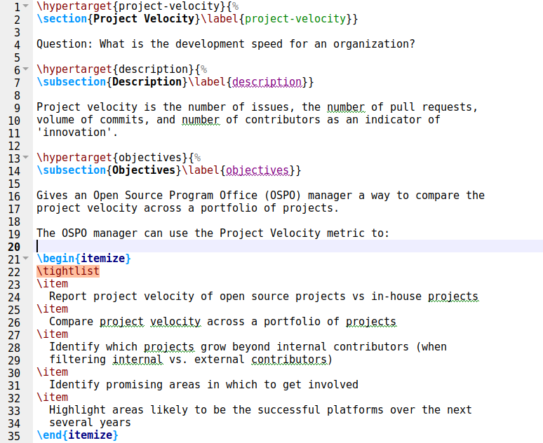
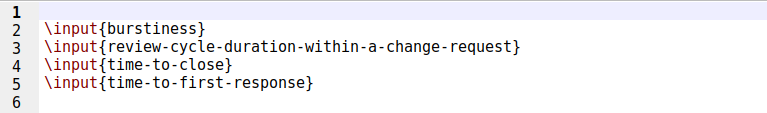

## Coding Period- Week 2 

The second week of the coding period started on a great note. The mentor/mentee meeting happened for the second time (Jaskirat joined for the first time 🎉). There were quite a few concerns and doubts that we were able to iron out.

The primary goal for the week was to extract the data from the YAML file and use it as raw input for the automation system.

The data from YAML file gets loaded in the form of a dictionary ([PyYAML](https://pypi.org/project/PyYAML/)). The insertion order of the dictionary is preserved as stated in the [documentation](https://docs.python.org/3/whatsnew/3.7.html) for Python 3.7+. Still, we might implement some checks for this as the project progresses 💭. Credits to Ritik for drafting the template of the YAML file and suggesting to use PyYAML! 

I used this data from the YAML file and created relative paths for the required images and metrics markdowns so they could be extracted. The standardization of repositories has already been done (Refer [community-bonding](community-bonding.md#standardization-of-wg-repos)). This enabled me to automatically generate those paths. 

Next, I used [PyPandoc](https://pypi.org/project/pypandoc/) ([Pandoc](https://pandoc.org/)) to convert the metric files from markdown to LaTeX format. 

Then, I added support to the script to automatically generate the focus_areas.tex and WG_name.tex files. These files contain the commands for nested inclusion (Using \input{} and \include{}) of metrics in the report.

The next stage involved creating a master LaTeX file that would get converted to PDF resulting in the required report. Once again, Thanks to Ritik for drafting the [cover page](https://github.com/ritik-malik/prototype-pipeline/blob/main/src/test-env/cover.tex) of the report 🙌

The final step involved calling Pandoc once again to generate the required [PDF report](https://github.com/yash2002109/chaoss-workspace/blob/yash-gsoc-dev/gsoc-project/Output.pdf). This is a skeleton version of the report and will require further work. 

That was the end of Week 2! 😎
