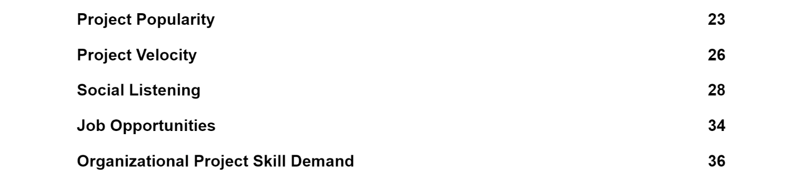
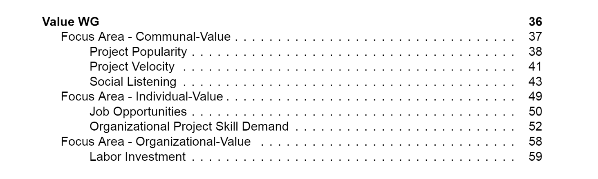

## Coding Period- Week 3

This week's task was quite important. In the previous week, I was able to create the automation such that it extracted the data from the YAML file and went ahead to create a skeleton PDF report.

Ritik had created the scripts in the previous to automatically extract the required information such as metric name and question from the markdown files.

This week, I was able to merge these two parts of the automation system. Now we have the scripts that perform the following tasks.

- Take input data from the YAML file
- Clone the required repositories
- Extract the relevant files
- Automatically create the tables of focus area with their goal and metric information from markdowns.
- Generate the file PDF report with 3 levels of hierarchy.

We have modified the earlier structure of the report and improved it for better readability. Thanks to Ritik for drafting the LaTeX files for this purpose.

Previous structure- 

Now- 

Further, we discussed the standardization process of the focus-area READMEs and metrics in the WG meetings. This will be implemented in the coming week.
