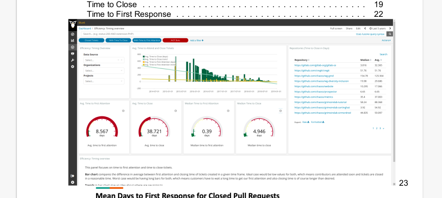
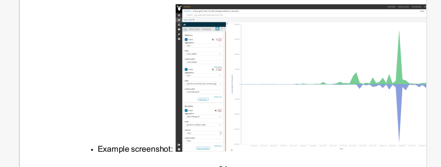

## Coding Period- Week 3

This week's task was quite important. In the previous week, I was able to automate the extraction of the data from the YAML file and went ahead to create a skeleton PDF report.

Ritik had created the scripts to automatically extract the required information such as metric name and question from the markdown files.

I was able to merge these two parts of the automation system. Now, we have the scripts that perform the following tasks.

- Take input data from the YAML file
- Clone the required repositories
- Extract the relevant files
- Automatically create the tables of focus area with their goal and metric information from markdowns.
- Generate the file PDF report with 3 levels of hierarchy.

We have modified the earlier structure of the report and improved it for better readability. Thanks to Ritik for drafting the LaTeX files for this purpose.

Previous structure- 

Now- 

Further, we discussed the standardization process of the focus-area READMEs and metrics in the WG meetings.

The process of standardization is crucial to the project, this is because the automation system extracts the required information from the markdown files relying on the fact that they follow their respective templates.

- [Focus Area READMEs](https://github.com/chaoss/governance/blob/master/templates/focus-areas.md)
- [Metrics](https://github.com/chaoss/metrics/blob/master/resources/metrics-template.md)

 I also faced some errors in generating the PDF. Some examples-

- Images displaying in the table of contents- 

    

- Images displaying inline with text-

    

These errors can be fixed by doing some minor changes in the markdown files. This will be implemented in the coming week along with the standardization of files for each working group.
