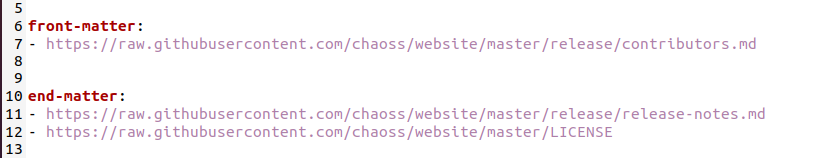

## Coding Period- Week 5

The weekly meeting could not take place since American Independence Day was being observed on July 5th. Additionally, I had the end-semester examinations that kept me occupied throughout the week. After consultation with mentors, we decided to call off the meeting.

This week, I mainly focused on testing the latest feature we had added to the automation system- Docker and on including some additional elements in the generated PDF.

Ritik had done a superb job on containerizing M.A.R.S. This week we were able to finalize the docker system for Linux (Debian-based) and MacOS/X.

We faced a large number of issues when using Windows. Many different approaches were tried that included using Docker, Powershell scripts, WSL, etc. We plan to discuss this further with the mentors in the weekly meeting.

I further added some additional pages in the PDF. The changes are made to mainly accommodate the following documents.

- [CHAOSS contributors](https://github.com/chaoss/website/blob/master/release/contributors.md)
- [Release Notes](https://github.com/chaoss/website/blob/master/release/release-notes.md)
- [LICENSE](https://github.com/chaoss/website/blob/master/LICENSE)

The pages were required to be added either at the start or at the end of the PDF. To achieve this, I created two new keys in the YAML file: `front-matter` and `end-matter`.

The URLs to the raw file of these documents can be added within these two keys. The documents are then downloaded using [Wget](https://www.gnu.org/software/wget/), converted to LaTeX, and then incorporated in the PDF. The docker images have also been updated to accommodate this new feature. 

The documents for the `front-matter` are included just after the table of contents whereas the documents for `end-matter` are appended to the report. 

The translations doc has been reviewed and I will be adding it to the community handbook page in the next week. I also plan to start with the automation system for translations and the documentation of the existing one. 

We also have the first evaluation of our GSoC project in the upcoming week...🤞
